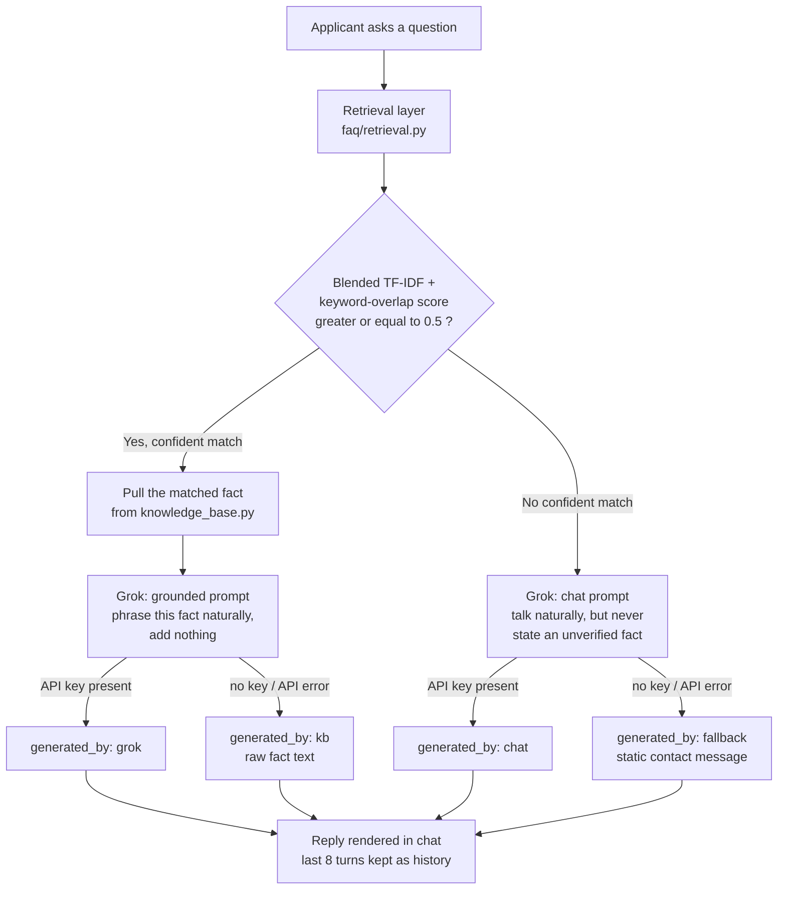

# 🎓 Pocho AI -  AI Admissions FAQ Assistant

<p>
  
  
  
  
  
  
</p>

A Retrieval-Augmented Generation (RAG) FAQ assistant built for the fictional Meridian State University Admissions Office. The system retrieves relevant information from a curated university knowledge base using TF-IDF and keyword-based retrieval, then uses the Grok (xAI) API to generate natural, context-aware responses.

The assistant is designed to handle common admissions questions such as programs, eligibility, application requirements, deadlines, fees, scholarships, and admission procedures. For questions outside the knowledge base, it provides a graceful conversational fallback instead of forcing an irrelevant retrieval-based answer.

> All dates, fees, GPAs, and contact details in this repo are placeholder
> data for demo purposes. Nothing reflects a real institution.

---

## 🧭 Pages

| Route | Purpose |
|---|---|
| `/` | **Home** — what the project is, how it works, browse the KB by department |
| `/chat/` | **Chat** — talk to the assistant |
| `/ask/` (POST) | JSON endpoint the chat UI calls |

Both pages share one sidebar: nav, quick facts, and every KB question
grouped by department. It collapses to an icon rail on desktop (state
remembered) and becomes a slide-in drawer on mobile.

---

## 🛠️ How it works

Every question goes through the same pipeline. The key design decision:
**the LLM is never allowed to state a fact it wasn't explicitly handed.**
Grok either paraphrases a KB fact verbatim-in-meaning, or it's kept to
small talk — there's no path where it can *guess* a deadline or a fee.



**1. Retrieval** (`faq/retrieval.py`)
The question is scored against every KB entry with a blend of TF-IDF
cosine similarity and keyword overlap against each entry's curated
paraphrases. The blend fixes two failure modes pure TF-IDF has on a small
corpus: generic shared words (like "campus") over-matching unrelated
questions, and very short queries under-matching.

**2. Grounded generation** (`faq/grok_client.py` → `generate_grounded_answer`)
If the best match clears `CONFIDENCE_THRESHOLD` (0.5), *only that matched
fact* is sent to Grok with instructions to phrase it naturally and add
nothing. This is the only path allowed to state a specific admissions
detail.

**3. Conversation, or forward** (`faq/grok_client.py` → `generate_chat_reply`)
No confident match doesn't mean a dead end. A second, differently-prompted
Grok call handles greetings, thanks, and "what can you help with" — but its
system prompt explicitly forbids inventing a fact it wasn't given. If Grok
is unavailable for either path, the app degrades gracefully to the raw KB
text or a static contact message, so the demo works without an API key.

The chat UI keeps a rolling window of the **last 8 exchanges** and sends it
with every request, so replies stay coherent turn to turn instead of
treating each message in isolation.

---

## 📚 Knowledge base

`faq/knowledge_base.py` holds `KNOWLEDGE_BASE` — 19 entries across 8
departments: Deadlines, Fees, Requirements, Financial Aid, Campus Life,
Academics, Process, and Contact.

```python
{
    "id": "fall_deadline",              # stable slug, shown in the match tag
    "category": "Deadlines",
    "question": "When is the fall application deadline?",
    "patterns": [...],                   # paraphrases used only for matching
    "answer": "The Fall semester application deadline is March 15. ...",
}
```

---

## 🚀 Running it

```bash
# 1. install dependencies
pip install -r requirements.txt

# 2. apply migrations (creates/updates db.sqlite3)
python manage.py migrate

# 3. run the dev server
python manage.py runserver
```

Visit **http://127.0.0.1:8000/**.

### 🔑 Enabling Grok

Create a `.env` file in the project root (same folder as `manage.py`) —
it's loaded automatically on startup via `python-dotenv`:

```dotenv
GROK_API_KEY=your-xai-api-key
GROK_MODEL=grok-3-mini   # optional, this is the default
```

Get a key from [console.x.ai](https://console.x.ai). `.env` is already
covered by `.gitignore` — never commit it.

Without a key, the app still runs: matched questions return the raw KB
text (`generated_by: "kb"`) and everything else returns the static
fallback message (`generated_by: "fallback"`) instead of a live reply.

---

## 🔌 API

`POST /ask/`

**Request**
```json
{
  "question": "When is the fall deadline?",
  "history": [
    {"role": "user", "content": "hey"},
    {"role": "assistant", "content": "Hi! How can I help with your application?"}
  ]
}
```
`history` is optional — the last 8 turns, used for conversational continuity.

**Response**
```json
{
  "answer": "The Fall semester application deadline is March 15.",
  "matched": true,
  "source": {"id": "fall_deadline", "category": "Deadlines", "score": 78},
  "generated_by": "grok"
}
```

| `generated_by` | Meaning |
|---|---|
| `grok` | Confident KB match, phrased by the LLM |
| `kb` | Confident KB match, raw KB text (Grok unavailable) |
| `chat` | No confident match, ungrounded conversational reply |
| `fallback` | No confident match and Grok unavailable — static contact message |

---

## 🗂️ Project structure

```
admissions_faq/
├── admissions_faq/            # Django project
│   ├── settings.py            #   loads .env via python-dotenv
│   └── urls.py
├── faq/
│   ├── knowledge_base.py      # FAQ data + CONFIDENCE_THRESHOLD
│   ├── retrieval.py           # TF-IDF + keyword-overlap matching
│   ├── grok_client.py         # xAI Grok client — grounded + chat paths
│   ├── views.py               # home / chat / ask
│   ├── urls.py
│   └── templates/faq/
│       ├── base.html          # shared sidebar, nav, design tokens
│       ├── home.html          # project overview + CTA
│       └── index.html         # chat UI
├── db.sqlite3
├── manage.py
├── requirements.txt
└── README.md
```

---

## 🧩 Tech stack

- **[Django](https://www.djangoproject.com/)** — views, routing, templating, SQLite via the ORM
- **[scikit-learn](https://scikit-learn.org/)** — `TfidfVectorizer` + cosine similarity for retrieval
- **[Grok (xAI)](https://x.ai/)** — OpenAI-compatible chat completions API for grounded phrasing + conversation
- **[python-dotenv](https://pypi.org/project/python-dotenv/)** — loads `GROK_API_KEY` from `.env`
- Vanilla HTML/CSS/JS on the frontend — no build step, no framework

---

## 🔭 Possible next steps

- Swap the in-memory KB list for a database model + Django admin CRUD
- Log unmatched questions to identify KB gaps
- Add real analytics on match-confidence distribution
- Streaming responses instead of a single JSON reply
